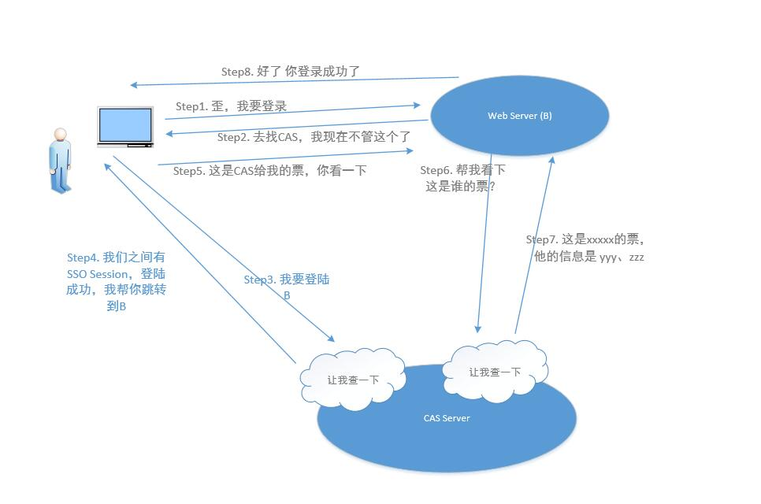

# 开发文档

文章写于`77a26cafd224fa8c48f085c364171bf7f7a15894`上，部分代码内容&位置可能变动，请注意通用性。

## USTC CAS认证问题

此部分内容参考了[这篇文章](https://blog.fyz666.xyz/blog/6401/)，和王峰老师的[文档](http://staff.ustc.edu.cn/~wf0229/cas/)，在此表示感谢。

在使用统一身份认证的时候，相关请求的过程如下：

在Life@USTC中，我们通过以下的办法来实现`URLSession`和`WKWebView`的无感登陆流程：

### `CasClient`类

[文件位置](/Models/USTC/UstcCAS.swift)

Source of Truth: 由于用户名和密码需要提供给`View`来更改，`username`&`password`由`ContentView`提供。

客户端的登录逻辑是：

* 获得LT-Token，
  * 请求地址：[https://passport.ustc.edu.cn/login]
  * GET请求
  * 临时 URLSession

    此结果返回值是网页，从中Parse出`"LT-[0-9a-z]+"`的LT-Token，并缓存这部分Cookie
* 模拟登录过程
  * 请求地址同上
  * POST请求 httpBody附带LT-Token，用户名，密码
  * URLSession.shared

* 如果Cookie中包含`logins`即为成功登录

此后，在不大于15分钟的间隔时，其余请求可直接以URLSession.shared进行。请求前请确保当前登陆状态

### `Service` 包装

使用`URL.ustcCASLoginMarkup()`包装一个URL，会以`https://passport.ustc.edu.cn/login?service=url.self`对这个URL进行包装。

注意，这个操作应该用在确定这个Service存在的前提下来请求。并注意service中处理CAS结果的回调地址：

比如`jw.ustc.edu.cn`的登陆过程：

`jw.ustc.edu.cn` -> `jw.ustc.edu.cn/login` -> `passport.ustc.edu.cn/login?service=https%3A%2F%2Fjw.ustc.edu.cn%2Fucas-sso%2Flogin` -> `jw.ustc.edu.cn/ucas-sso/login`

这时，请包装`jw.ustc.edu.cn/ucas-sso/login`，而不是包装`jw.ustc.edu.cn`，因为CAS只会302会到回调service地址，而默认的`jw.ustc.edu.cn`或者`jw.ustc.edu.cn/login`无法处理CAS的回调。

## 课表须知

TBC

## 命名规范

参考Swift标准命名，争议内容请在Discord中讨论，以讨论结果为准。

## 格式化规范

使用`swiftformat`，默认参数。后续调整见Discord。
