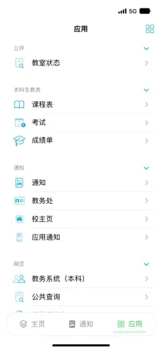

# 学在科大 iOS版

## 简介

学在科大是一个非官方的应用，旨在帮助科大学生获取日常学业相关信息。

用户可在应用内方便查看课表、成绩、考试安排、作业安排等。

iOS 版本可在[App Store](https://apps.apple.com/cn/app/%E5%AD%A6%E5%9C%A8%E7%A7%91%E5%A4%A7/id1643944931) 下载。

## 截图

|  |  |  |  |
--- | --- | --- | ---

## 功能

- [x] 登录到 USTC 的统一身份认证系统
- [x] RSS 消息源
- [x] 本科生课表
- [x] 本科生成绩
- [x] 本科生考试安排
- [x] 本科生作业安排
- [x] APN Push消息推送
- [x] 研究生课表
- [x] 学校教室使用情况查询
- [x] 校车查询

## 编译环境

- Xcode 15.0+
- Swift 5.7+
- iOS 16.0+
