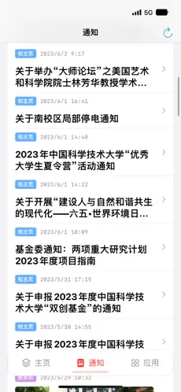
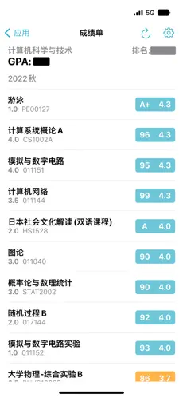

# Life@USTC

## 简介

Life@USTC 是一个非官方的应用，旨在帮助科大学生获取日常学业相关信息。

用户可在应用内方便查看课表、成绩、考试安排、作业安排等。

[App Store](https://apps.apple.com/us/app/life-ustc/id1660437438)

## 截图

|  |  |  |  |
| --------------------------------------------- | --------------------------------------------- | --------------------------------------------- | --------------------------------------------- |

## 功能

- [x] 统一身份认证系统登录
- [x] 校车查询
- [x] RSS 消息源

### 本科生

- [x] 课表
- [x] 成绩
- [x] 考试
- [x] 作业

### 研究生

- [x] 课表

### TODO

- [ ] APN Push 消息推送
