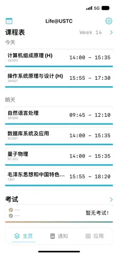

# Life@USTC
|  |      |
| :--- | :--- |

## Introduction

Life@USTC is an iOS app that helps students at USTC to get information about their daily life.

Users can see their curriculum, grades, exams, and more, all without leaving the app.

You can get the app from the [App Store](https://apps.apple.com/cn/app/life-ustc/id1660437438).

## Screenshots

| `HomeView` | `AllSourceView` | `FeaturesView` | `ScoreView` |
--- | --- | --- | ---
|  |  |  |  |

## Features

- [x] Login to USTC's CAS system, keep the background state refreshed
- [x] RSS Feed
- [x] Undergraduate curriculum
- [x] Undergraduate grades
- [x] Undergraduate exam arrangement
- [x] APN push notifications
- [ ] Information refresh notifications
- [ ] Push notifications for student union and clubs

> You could also implement this for your own school, say THU for example. All logic that are bounded with USTC are now stored in `School/USTC/` folder, you could easily add your own school by following the same structure.
>
> We hope you could contribute your own school's logic to this project, so that more students could benefit from it.

## Requirements

- Xcode 14.0+
- Swift 5.7+
- iOS 16.0+
